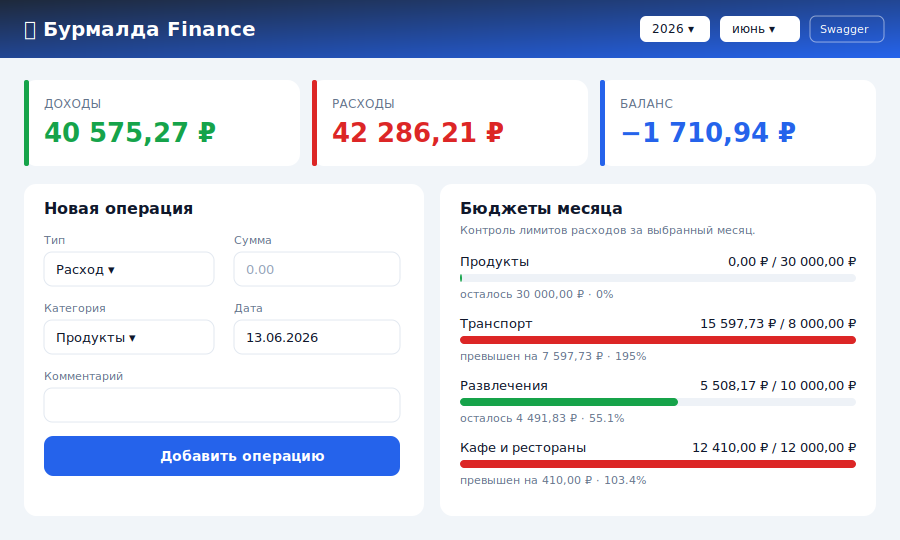

# 💰 Бурмалда Finance — сервис учёта личных финансов

Веб‑приложение для учёта личных доходов и расходов: ведение операций по
категориям, месячные бюджеты с контролем лимитов и аналитика (сводки,
разбивки по категориям, тренды по месяцам).

Проект выполнен в рамках производственной практики (этап «Анализ →
Разработка → Тестирование → Развёртывание»). Выбранная тема —
**«веб‑приложение для учёта личных финансов»**.



---

## Возможности

- **Категории** доходов и расходов (CRUD, уникальность имени в пределах типа).
- **Операции** с фильтрами по типу, категории и периоду; валидация суммы и
  соответствия типа операции типу категории.
- **Бюджеты** — месячный лимит расходов по категории и автоматический расчёт
  исполнения (потрачено / остаток / процент / перерасход).
- **Аналитика** — сводка за период, разбивка по категориям, тренд по 12 месяцам.
- **Документация API** автоматически: Swagger UI (`/docs`) и ReDoc (`/redoc`).
- **Адаптивный интерфейс** (десктоп и мобильные устройства) без внешних
  зависимостей — чистый HTML/CSS/JS.

## Технологический стек

| Слой | Технология |
|------|------------|
| Язык | Python 3.11+ |
| Веб‑фреймворк / API | FastAPI |
| ORM / БД | SQLAlchemy 2.0 + SQLite |
| Валидация / схемы | Pydantic v2 |
| Сервер | Uvicorn (ASGI) |
| Тесты | pytest + httpx (TestClient) |
| Фронтенд | HTML5 + CSS3 + ванильный JavaScript |
| CI / контейнеризация | GitHub Actions + Docker |

Подробнее — в [техническом задании](docs/ТЗ.md).

---

## Архитектура (кратко)

Приложение построено по слоистой архитектуре с инверсией зависимостей:

```
HTTP-запрос
   │
   ▼
routers/        ← HTTP-слой (FastAPI): маршруты, коды ответов
   │  Depends()
   ▼
services/       ← бизнес-логика и правила предметной области
   │
   ▼
repositories/   ← доступ к данным (запросы SQLAlchemy)
   │
   ▼
models/         ← ORM-модели (таблицы БД)
```

`schemas/` (Pydantic) описывают входные/выходные данные и валидацию,
`core/` — доменные исключения и их преобразование в HTTP‑ответы,
`dependencies.py` собирает цепочку `сессия → репозитории → сервисы`.

Полное описание и диаграммы:
- [Архитектура и UML‑диаграммы](docs/architecture.md) (use case, классы, sequence);
- [Схема базы данных и ER‑диаграмма](docs/database.md);
- [Справочник REST API](docs/api.md).

---

## Быстрый старт

### Требования
- Python **3.11+**
- (опционально) Docker

### Установка и запуск (Windows / PowerShell)

```powershell
# 1. Клонировать репозиторий и перейти в каталог
git clone <URL-репозитория> burmalda-finance
cd burmalda-finance

# 2. Создать и активировать виртуальное окружение
python -m venv .venv
.\.venv\Scripts\Activate.ps1

# 3. Установить зависимости
pip install -r requirements.txt

# 4. Заполнить БД тестовыми данными (опционально, но рекомендуется для демо)
python -m scripts.seed --reset

# 5. Запустить сервер
uvicorn app.main:app --reload
```

### Установка и запуск (Linux / macOS / bash)

```bash
git clone <URL-репозитория> burmalda-finance
cd burmalda-finance
python3 -m venv .venv
source .venv/bin/activate
pip install -r requirements.txt
python -m scripts.seed --reset
uvicorn app.main:app --reload
```

После запуска открыть в браузере:

| Адрес | Назначение |
|-------|-----------|
| <http://127.0.0.1:8000/> | Веб‑интерфейс |
| <http://127.0.0.1:8000/docs> | Swagger UI (интерактивная документация API) |
| <http://127.0.0.1:8000/redoc> | ReDoc |
| <http://127.0.0.1:8000/api/health> | Проверка живости |

### Запуск через Docker

```bash
docker build -t burmalda-finance .
docker run -p 8000:8000 burmalda-finance
```

Инструкции по развёртыванию на сервере (Railway/Render и т. п.) — в
[docs/deployment.md](docs/deployment.md).

---

## Тестирование

```powershell
# Запустить все тесты (модульные + интеграционные)
pytest

# С подробным выводом
pytest -v
```

В проекте **44 теста**: модульные (бизнес‑логика сервисов) и интеграционные
(HTTP‑API через `TestClient`). Отчёт о тестировании — в
[docs/test-report.md](docs/test-report.md).

---

## Структура проекта

```
бурмалда/
├── app/                     # исходный код приложения
│   ├── main.py              # фабрика FastAPI, подключение роутеров и фронтенда
│   ├── config.py            # настройки (через переменные окружения)
│   ├── database.py          # engine, сессии, базовый класс моделей
│   ├── dependencies.py      # сборка зависимостей (DI)
│   ├── core/                # доменные исключения и обработчики ошибок
│   ├── models/              # ORM-модели: Category, Transaction, Budget
│   ├── schemas/             # Pydantic-схемы (DTO) и валидация
│   ├── repositories/        # слой доступа к данным
│   ├── services/            # бизнес-логика
│   └── routers/             # HTTP-маршруты (API)
├── static/                  # фронтенд (index.html, styles.css, app.js)
├── scripts/seed.py          # наполнение БД тестовыми данными
├── tests/                   # модульные и интеграционные тесты
├── docs/                    # ТЗ, UML/ER-диаграммы, отчёты, инструкции
├── requirements.txt
├── Dockerfile
├── pytest.ini
└── .github/workflows/ci.yml # CI: установка зависимостей и прогон тестов
```

## Документация проекта

| Документ | Содержание |
|----------|-----------|
| [docs/ТЗ.md](docs/ТЗ.md) | Техническое задание: требования, user stories, стек, архитектура |
| [docs/architecture.md](docs/architecture.md) | UML‑диаграммы (use case, классы, sequence) |
| [docs/database.md](docs/database.md) | ER‑диаграмма и описание схемы БД |
| [docs/api.md](docs/api.md) | Справочник REST API |
| [docs/deployment.md](docs/deployment.md) | Инструкция по развёртыванию и запуску |
| [docs/test-report.md](docs/test-report.md) | Отчёт о тестировании (найденные/исправленные ошибки) |
| [docs/individual-report.md](docs/individual-report.md) | Индивидуальный отчёт |

## Лицензия

MIT — свободное использование в учебных целях.
