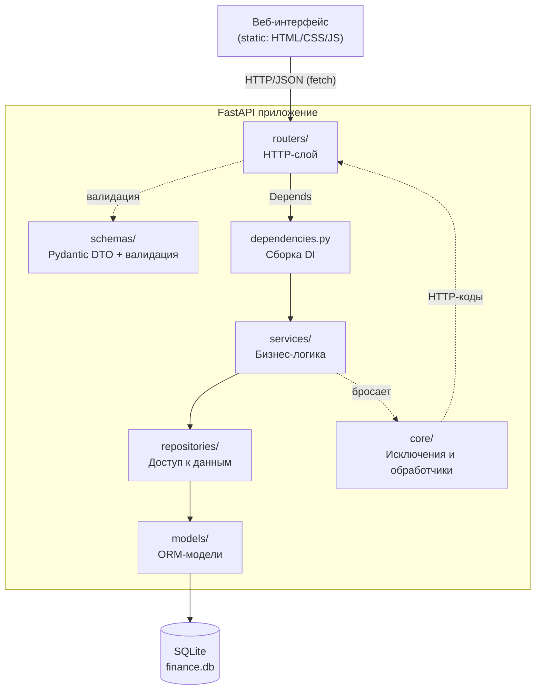
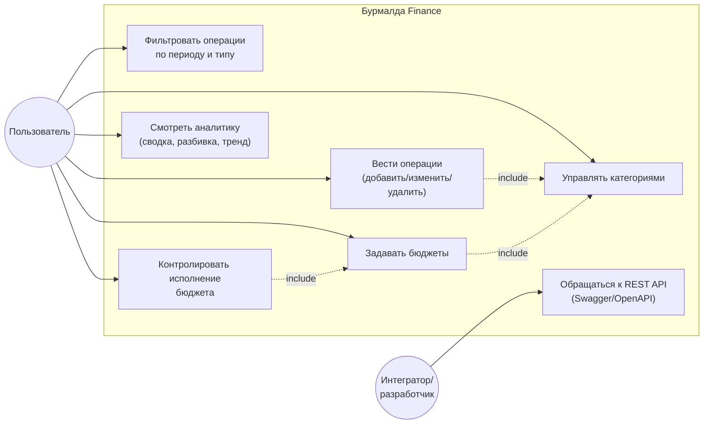
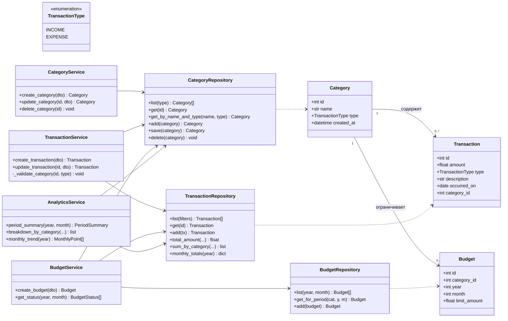
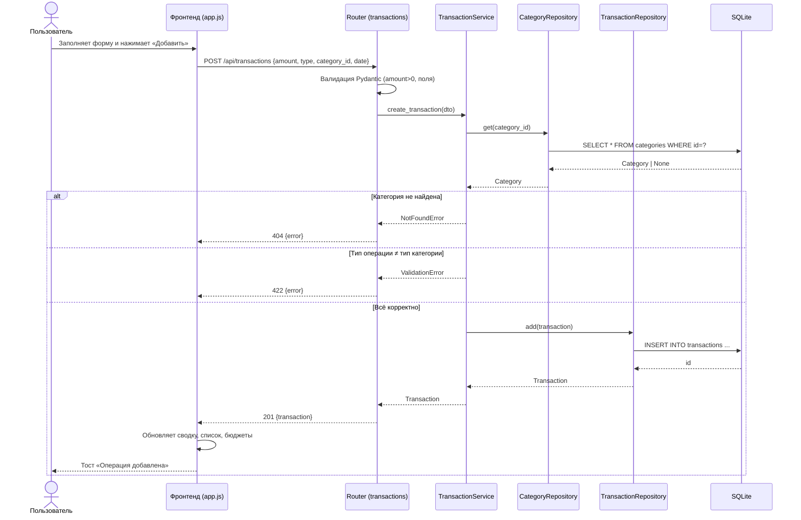
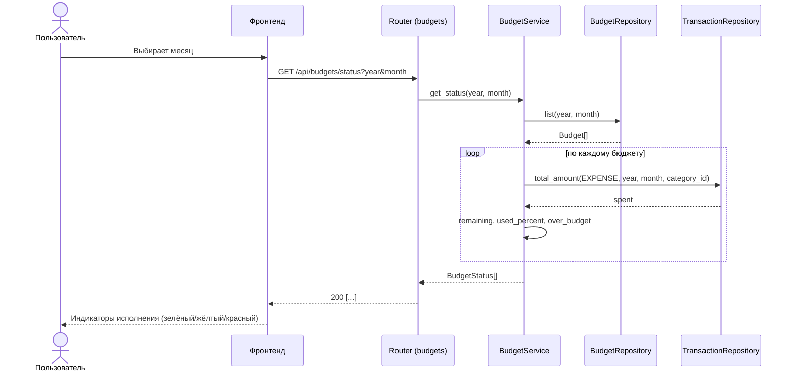

# Архитектура и UML‑диаграммы

Документ описывает архитектуру приложения «Бурмалда Finance» и содержит
диаграммы в нотации UML (Mermaid — отображаются на GitHub/GitLab).

---

## 1. Слоистая архитектура



**Принцип:** запрос проходит сверху вниз. Каждый слой зависит только от
соседнего нижнего и общается через абстракции (репозитории, схемы). Это
реализует принципы **SRP** (одна ответственность на слой) и **DIP**
(сервисы зависят от репозиториев, внедряемых через конструктор).

---

## 2. Диаграмма вариантов использования (Use Case)



---

## 3. Диаграмма классов (Class Diagram)

Показаны ключевые классы серверной части и их связи.



**Замечания по SOLID:**
- сервисы получают репозитории через конструктор (внедрение зависимостей);
- сервис не знает, как именно репозиторий хранит данные (SQLite/PostgreSQL);
- каждый репозиторий работает только со своей сущностью.

---

## 4. Диаграмма последовательности (Sequence) — создание операции

Сценарий: пользователь добавляет расход через интерфейс.



---

## 5. Диаграмма последовательности — расчёт исполнения бюджета



---

## 6. Обработка ошибок

Бизнес‑логика бросает доменные исключения (`NotFoundError`, `ConflictError`,
`ValidationError`), не зная про HTTP. Обработчик в `core/error_handlers.py`
переводит их в коды ответа и единый формат:

```json
{ "error": { "type": "ValidationError", "message": "…" } }
```

| Исключение | HTTP‑код |
|------------|----------|
| `NotFoundError` | 404 Not Found |
| `ConflictError` | 409 Conflict |
| `ValidationError` (бизнес‑правило) | 422 Unprocessable |
| Ошибка валидации Pydantic | 422 (стандартный формат FastAPI) |
