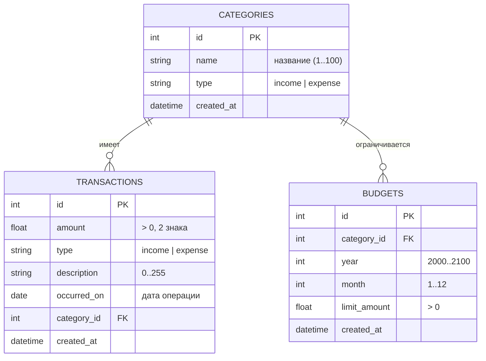

# Схема базы данных и ER‑диаграмма

СУБД: **SQLite** (файл `finance.db`). ORM: **SQLAlchemy 2.0**.
Схема создаётся автоматически из ORM‑моделей (`app/models`).

---

## 1. ER‑диаграмма

---

## 2. Описание таблиц

### 2.1. `categories` — категории

| Поле | Тип | Ограничения | Описание |
|------|-----|-------------|----------|
| `id` | INTEGER | PK, autoincrement | Идентификатор |
| `name` | VARCHAR(100) | NOT NULL, index | Название категории |
| `type` | VARCHAR(20) | NOT NULL, index | `income` / `expense` |
| `created_at` | DATETIME | NOT NULL | Дата создания |

**Ограничения:** `UNIQUE(name, type)` — имя уникально в пределах типа.

### 2.2. `transactions` — операции

| Поле | Тип | Ограничения | Описание |
|------|-----|-------------|----------|
| `id` | INTEGER | PK | Идентификатор |
| `amount` | FLOAT | NOT NULL, > 0 | Сумма операции |
| `type` | VARCHAR(20) | NOT NULL, index | `income` / `expense` |
| `description` | VARCHAR(255) | NOT NULL (по умолчанию "") | Комментарий |
| `occurred_on` | DATE | NOT NULL, index | Дата операции |
| `category_id` | INTEGER | FK → categories.id, ON DELETE CASCADE, index | Категория |
| `created_at` | DATETIME | NOT NULL | Дата создания записи |

**Индексы:** составной `ix_transactions_date_type(occurred_on, type)` —
ускоряет выборки за период и аналитику.

### 2.3. `budgets` — бюджеты (месячные лимиты)

| Поле | Тип | Ограничения | Описание |
|------|-----|-------------|----------|
| `id` | INTEGER | PK | Идентификатор |
| `category_id` | INTEGER | FK → categories.id, ON DELETE CASCADE, index | Категория расходов |
| `year` | INTEGER | NOT NULL | Год |
| `month` | INTEGER | NOT NULL (1..12) | Месяц |
| `limit_amount` | FLOAT | NOT NULL, > 0 | Лимит расходов |
| `created_at` | DATETIME | NOT NULL | Дата создания |

**Ограничения:** `UNIQUE(category_id, year, month)` — один бюджет на категорию
в пределах месяца. Бизнес‑правило (на уровне сервиса): бюджет допустим только
для категории типа `expense`.

---

## 3. Связи и целостность

- `transactions.category_id → categories.id` (многие‑к‑одному).
- `budgets.category_id → categories.id` (многие‑к‑одному).
- При удалении категории связанные операции и бюджеты удаляются каскадно
  (`cascade="all, delete-orphan"` в ORM и `ON DELETE CASCADE` на FK).

> **Примечание.** SQLite по умолчанию не проверяет внешние ключи. Каскад
> обеспечивается на уровне ORM (SQLAlchemy `cascade`), что покрыто тестами
> (удаление категории удаляет её операции). При переходе на PostgreSQL
> каскад работает и на уровне БД.

---

## 4. Нормализация

Схема соответствует **3НФ**:
- атомарные значения, нет повторяющихся групп;
- неключевые атрибуты зависят от всего первичного ключа;
- нет транзитивных зависимостей (название категории хранится один раз в
  `categories`, операции ссылаются на неё по `id`).

---

## 5. Тестовые данные

Скрипт [`scripts/seed.py`](../scripts/seed.py) наполняет БД:
- 11 категорий (4 дохода + 7 расходов);
- ~70–80 операций за последние 6 месяцев (детерминированный `random.seed=42`);
- 4 бюджета на текущий месяц.

Запуск: `python -m scripts.seed --reset`.
